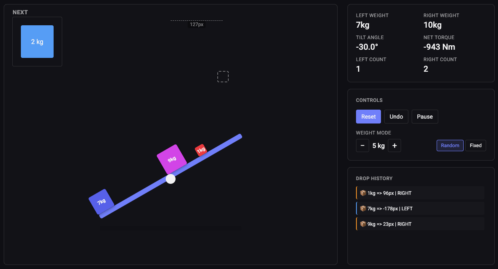

# Seesaw Simulation

An interactive, physics-based seesaw built with pure HTML, CSS, and JavaScript. No frameworks, no libraries.



🔗 **Live Demo:** [https://razortype.github.io/orkun-kurul-seesaw/](https://razortype.github.io/orkun-kurul-seesaw/)

## How it works

Click over the plank to drop a random weight (1–10 kg). The plank tilts based on torque: weight times distance from the pivot, clamped at ±30°. State is saved in `localStorage` so your session persists across reloads.

## Features

Weights fall with gravity, land on the tilted plank surface, and contribute to torque. A smooth CSS transition animates the tilt up to ±30°.

The sidebar shows left/right weight, net torque, tilt angle, and drop count. It also keeps a drop history log. Controls: Reset, Undo, and Pause (with an overlay banner).

UI Enhancements:
- Hover preview (dashed outline, sized to next weight)
- Distance-from-pivot indicator while hovering
- Next-weight preview box
- Ground shadow that shrinks with plank projection
- Weight mode toggle (Random 1–10 kg / Fixed with stepper)

## Architecture

### State

All stats (left/right weight, counts, torque, angle) are computed from `state.weights` on demand. I don't keep them as separate fields. The array is the truth, and `computeStats()` derives everything from it. This way undoing or resetting never leaves a ghost counter behind.

Falling weights and landed weights are kept in two separate arrays. Only landed (attached) weights contribute to torque, so the plank doesn't react to something still in the air. Likewise refreshing page will not include on-air weights.

### Rendering

Instead of a single function that updates everything on every change, each piece of UI has its own render function: `renderStats`, `renderWeightMode`, `renderPause`, and so on. When a weight lands, only the stats and tilt update; when the user toggles random/fixed, only the mode buttons and stepper update. `renderAll()` is used once, on page load, to sync everything from saved state.

### Plank geometry

`getPlankProjection()` is the one place that knows the plank's current angle and horizontal projection (`length × cos(angle)`). Click detection, ground shadow width, and the distance indicator all read from it. If the plank length or physics changes, I change one function.

I used the actual trigonometric projection instead of the rotated bounding box width, because the bounding box is wider than the plank's real horizontal span (it includes the diagonal), and torque depends on horizontal distance.


## Physics Model
 
```
torque = sum(weight * signed_distance_from_pivot)
angle  = clamp(-30°, +30°, totalTorque / 10)
```
 
Distance is signed. Negative on the left, positive on the right. So `weight × distance` already gives the right sign, and summing them gives net torque directly. No need for separate left/right totals that cancel out.
 
Collision with a tilted plank uses the line equation:
 
```
surface_y(x) = pivot_y + (x - pivot_x) × tan(angle)
```
 
That way a falling weight knows exactly where to stop no matter how tilted the plank is.
 
## Trade-offs
 
The click listener is on the playground, not directly on the plank. The plank is only 12px tall and hitting it precisely would be frustrating, so I filter clicks by the plank's horizontal projection instead. Drops are still limited to the plank region, the hit area is just kinder.
 
Landed weights become children of the plank element. That way when the plank rotates, the weights rotate with it as one rigid body — no per-weight transform math.
 
`state.paused` and `state.falling` aren't persisted to `localStorage`. Pause is a session-level thing and a mid-air weight isn't meaningful state to resume.
 
Stats are derived, not stored. Recomputed on each render. Cheap at this scale and there's no way for them to drift out of sync.
 
## Project Structure
 
```
├── index.html
├── style.css
├── script.js
├── assets/
└── README.md
```
 
No build step. Open `index.html` in a browser or serve the folder with any static server.
 
## Running Locally
 
```bash
# any static server works
npx live-server
 
# or just open index.html directly in your browser
```

## AI Usage

I used Claude (Anthropic) as a pair-programming assistant throughout this task, primarily for:
- **HTML/CSS scaffolding** - layout skeleton, card/button component styles, CSS variable scales (spacing, typography, radius)
- **Debugging** - catching bugs like parameter-order mismatches, null references when `localStorage` returned invalid data, missed sign on the tilt angle display
- **Architecture discussions** - trading ideas before committing to an approach (e.g. I considered a single `syncUI()` render function but pushed back in favor of split, focused render functions)
- **Documentation polish** - wording tweaks and readability improvements for this README

Several of the refactors came from my own observations: extracting `getPlankProjection` so click detection, shadow, and distance indicator share one source of geometry; using signed distance instead of absolute value plus side; splitting UI rendering into focused functions instead of a single sync call. I treated AI suggestions as one input among many and pushed back when they didn't fit.

## A note on commit history

The first commit (`chore: project scaffolding and ui layout`) contains the static HTML/CSS setup because I iterated on the UI skeleton before initializing Git. Every commit after that is atomic — one per feature, refactor, or fix. You can follow the whole build step by step:

```
git log --oneline
```

## Author

Orkun Kurul
orkun.kurul@gmail.com
